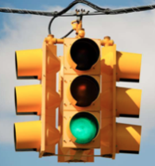

# Traffic Light Problem

To build a mental model of how Raft might operate and be structured, it helps to look
at an example of event-driven programming.  This project explores a
greatly simplified problem involving a traffic light.  Although not
directly related to Raft perhaps, the programming techniques used here
may be useful later.

## A Traffic Light

You have been been tasked with writing the control software for a
simple traffic light.  So, let's think about traffic lights for a
moment.  First, there is the light itself:



It shows a different color in each direction.  For this exercise,
assume that there are just two directions (e.g., NORTH-SOUTH,
and EAST-WEST).  Suppose that the traffic light also has pedestrian
push buttons.  For example:


Pressing a button makes a green light transition to red, but only after the
light has been green for at least 15 seconds.

### Operational States

A traffic light operates by stepping through a specific sequence of
timed states wherein the lights change colors.  However, the
pedestrian button alters the timing of the cycle.  Here's an example
of a possible state cycle:


In this diagram, the light shows green for 30 seconds in one direction
and 60 seconds in the other.  Yellow lights always show for 5 seconds
as the light changes.  Pedestrian buttons shorten the light cycle
time, but lights still must show green for at least 15 seconds before
changing (i.e., pressing the button won't cause the light to instantly
change if it just became green).

### Some Light-Building Components

Suppose that you're given a collection of pre-built components for
constructing a traffic light including some light display modules and
a push button module.  For some reason, suppose that all of these
were internet-enabled and written in Python (okay, a really bad idea,
but work with me).

In the directory `traffic` you'll find a file `light.py`.  This is a
UDP-controlled light module.  In a separate terminal window, run it:

```
bash $ python traffic/light.py "East-West" 10000
East-West: R
```

Now, in a completely separate window, open up an interactive Python
session and send it some messages to change the light color:

```
>>> from socket import socket, AF_INET, SOCK_DGRAM
>>> sock = socket(AF_INET, SOCK_DGRAM)
>>> sock.sendto(b'G', ('localhost', 10000))
>>>
```

You should see the output of the light change.  Try sending messages
such as `b'R'`, `b'Y'`, `b'G'`.  That's about all there is to a
light. If you want multiple lights, run more copies of the `light.py`
program in different terminal windows using different port numbers.

The file `button.py` has code for a push button.  Run it in a separate
terminal window:

```
bash $ python traffic/button.py NS localhost 12000
Button NS: [Press Return]
```

Try pressing `return` a few times.  Okay, very exciting.  The button
program sends a message with the button id to a host/port address of
your choosing.  Open a Python session in a different terminal window
and receive the messages from the button:

```
>>> from socket import socket, AF_INET, SOCK_DGRAM
>>> sock = socket(AF_INET, SOCK_DGRAM)
>>> sock.bind(('',12000))
>>> while True:
...      msg, addr = sock.recvfrom(1024)
...      print(msg)
...
```

With this running, go to the terminal with the `button.py` program and
press return.  You should now see a "NS" message being
displayed in the other terminal.  If you want multiple buttons,
run multiple copies of the button program and give each button
a unique name so that you can tell them apart.  

### Your Task

Your task is to write the control software and runtime environment for
the traffic light described in this problem. Specifically, here's the
light configuration:

1. A single East-West light
2. A single North-South light
3. A push button (NS) to change the East-West light to red.
4. A push button (EW) to change the North-South light to red.

Here are the behaviors that need to be encoded in your controller:

1.  The East-West light stays green for 30 seconds.
2.  The North-South light stays green for 60 seconds. 
3.  Yellow lights always last 5 seconds.
4.  A push-button causes the corresponding light to change immediately
    if it has been green for more than 15 seconds.  If less than 15
    seconds have elapsed, the button press is remembered and the light
    will change once it has been green for 15 seconds.

### How to Proceed

To solve this problem, it first helps to understand that there are
number of things happening concurrently.  First, there is time
evolution.  So, somehow your controller needs to keep an internal
clock to manage light cycle times.  Second, there are incoming events
(the button press).  So, the controller also needs to monitor that.

You should structure your solution around event-processing. One
way to do that is to have separate functions or methods for the
different kinds of events:

```
def handle_clock_tick(state):
    ...

def handle_button_press(state, button_id):
    ...
```

You might also consider the use of a queue as a mechanism for
serializing the events and implementing the runtime:

```
import queue

event_queue = queue.Queue()
while True:
    evt = event_queue.get()
    if is_clock_tick(evt):
         handle_clock_tick(state)
    elif is_button_press(evt):
         handle_button_press(state, evt)
    else:
         raise RuntimeError(f"Unknown event {evt}")
```

Finally, to handle any concurrency, you might consider the use of threads.
For example, to generate clock ticks, you could do this:

```
import threading
import time

def generate_ticks(interval):
    while True:
        time.sleep(interval)
	event_queue.put('tick')

threading.Thread(target=generate_ticks, args=(1,)).start()
```

Keep in mind that this is only a rough sketch.  You'll need to fill in
details and adapt it if working in a different programming language.
If you have different ideas about how it should work, that's fine as
long as your solution satisfies the basic requirements of the problem
concerning timing and button presses.

Finally, the configuration of the whole system is rather complicated.  For
example, you'll have two `light.py` programs and two `button.py` programs
running at the same time as your controller when in operation.  This
makes testing and debugging all the more challenging.  In fact, it
might be challenging just to put everything together in your IDE or
terminal as you'll need to be running at least 5 programs at once.
Figuring out how to manage this complexity is part of the project.


